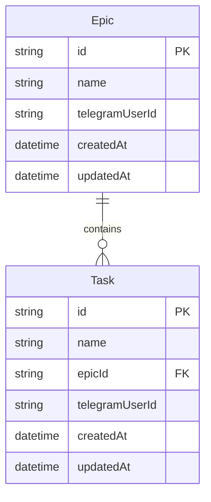

# Taskmaster

Taskmaster is a production-ready Telegram bot for processing epics and tasks inside Telegram. It uses a text-first command flow, inline selection buttons, and a webhook-first architecture that works consistently in local development and on Vercel.

## Project overview

Taskmaster lets each Telegram user work through an existing backlog without memorising IDs. The bot is intentionally stripped down to four commands and two message prefixes: send `t ...` to stage one or more tasks, send `e ...` to create epics, use `/t` to browse tasks by epic, use `/e` to delete epics, and use `/c` to cancel the current operation.

Core capabilities:

- `t ...` creates a pending batch of one or more tasks from a single user message
- Inline epic selection assigns the whole task batch to one epic in the next step
- Inline `Create epic` lets the user create a missing epic without restarting the task flow
- `/t` shows epics as inline buttons, then shows tasks for the selected epic
- Tapping a task deletes it immediately, so complete means deleted
- `/e` shows epics as inline buttons and deletes the selected epic together with all of its tasks
- `/c` cancels the current pending operation without replaying the `/start` introduction

## Runtime structure

The application is split by responsibility rather than by Telegram feature.

- `src/server.ts`: Local Express server for development.
- `api/telegram/webhook.ts`: Vercel entrypoint that forwards Telegram webhook requests into shared app logic.
- `src/api/telegramWebhook.ts`: Validates the webhook request and hands the update to the bot.
- `src/bot/createBot.ts`: Creates the Telegraf bot once, registers handlers, and bootstraps the Telegram command list.
- `src/commands`: Slash-command entrypoints for `/start`, `/t`, `/e`, and `/c`.
- `src/scenes/navigationTextRouter.ts`: Handles plain text messages, including `t ...`, `e ...`, and the follow-up epic name in the task-batch flow.
- `src/actions/callbackRouter.ts`: Handles inline-button callback payloads.
- `src/bot/replies.ts`: Presentation layer that renders bot messages and inline keyboards.
- `src/keyboards`: Builds the inline keyboards used by the reply layer.
- `src/services`: Business logic for epics, tasks, bootstrap, and Redis-backed workflow state.
- `src/repositories`: Prisma access layer for epics and tasks, plus the Redis-backed session repository.
- `src/utils`: Shared Telegram helpers, callback-data builders, errors, and logging.
- `src/lib/redis.ts`: Shared Upstash Redis HTTP client wrapper for transient workflow state.
- `prisma/schema.prisma`: Database schema for epics and tasks.

The bot stays stateless at the process level for browsing because inline callback payloads carry the selected entity IDs. It persists only the pending message-driven workflow state in Redis, so a user can send `t item one\nitem two` first and choose or create the destination epic in the next step without relying on process memory.

## Storage model

Taskmaster now uses two storage layers with distinct responsibilities:

- Postgres via Prisma stores durable domain data: epics and tasks.
- Redis stores transient per-user workflow state for pending task-batch operations.

### ER diagram



### Storage architecture

```mermaid
flowchart LR
   Telegram[Telegram] --> Webhook[Webhook handler]
   Webhook --> Bot[Telegraf bot]
   Bot -->|Create/list/delete epics and tasks| Postgres[(Postgres via Prisma)]
   Bot -->|Read/write transient workflow state| Redis[(Redis)]
   Redis --> SessionKey[user-session:{telegramUserId}:operation\nkind\ntaskNames\nTTL refresh on write]
```

## Request path

Every Telegram update moves through the same top-level path:

1. Telegram sends a webhook request.
2. `api/telegram/webhook.ts` receives the request on Vercel, or `src/server.ts` receives it locally.
3. `src/api/telegramWebhook.ts` validates the method and webhook secret.
4. `src/bot/createBot.ts` provides the Telegraf bot instance and routes the update by type.
5. One of three branches handles the update:
   - slash commands go through `src/commands`
   - inline button taps go through `src/actions/callbackRouter.ts`
   - normal text goes through `src/scenes/navigationTextRouter.ts`
6. Those handlers call services and then render the next Telegram message through `src/bot/replies.ts`.

## Flow map

The bot has three active control surfaces, and each one owns a different part of the flow.

### Slash commands

- `/start` is registered in `src/commands/start.ts`
- `/t` is registered in `src/commands/t.ts`
- `/e` is registered in `src/commands/e.ts`
- `/c` is registered in `src/commands/c.ts`
- `src/commands/index.ts` wires all four into the bot.

These files are intentionally thin. They only identify the current user, choose the next action, and call either the reply layer or the session layer.

### Text-driven flow

`src/scenes/navigationTextRouter.ts` owns the message-first flow.

- `t ...` parses one or more task names, stores them in `sessionService`, and opens the epic picker.
- `e ...` creates one or more epics directly from the message text.
- plain text is ignored unless the user is currently in `TASK_BATCH_CREATE_EPIC_NAME` mode.
- when the user is in that mode, the next text message becomes the new epic name and the staged tasks are created under it.

The text router is where the nested decision tree for typed input lives. It decides whether the incoming text is:

- a staged task batch
- an immediate epic creation request
- a follow-up response inside an existing session
- or irrelevant to the bot flow

### Inline-button flow

`src/actions/callbackRouter.ts` owns the inline-button side of the bot.

- `tb` opens the task epic browser
- `tv` opens one epic's task list
- `td` deletes a task and refreshes the current epic view
- `eb` opens the epic deletion browser
- `ed` deletes an epic and refreshes the epic browser
- `ts` assigns staged tasks to an existing epic
- `tc` switches the staged task flow into “create a new epic name” mode
- `cx` cancels the current session

This file is the routing layer for callback payloads. It does not build keyboards or compose text itself; it delegates rendering to `src/bot/replies.ts`.

### Reply/presentation flow

`src/bot/replies.ts` is the presentation layer.

- it fetches any data needed to render the next screen
- it chooses the user-facing text
- it attaches the correct inline keyboard
- it decides whether the bot should send a new message or edit the existing one in place

This is what keeps `callbackRouter.ts` and `navigationTextRouter.ts` from filling up with Telegram formatting code.

## Data and session layers

The service and repository layers are deliberately small:

- `src/services/epicService.ts`: epic creation, lookup, and deletion rules
- `src/services/taskService.ts`: task creation, lookup, ownership checks, and deletion rules
- `src/services/sessionService.ts`: per-user workflow state for `/start` state and pending task batches
- `src/services/bootstrapService.ts`: one-time Telegram command registration
- `src/repositories/epicRepository.ts`: Prisma queries for epics
- `src/repositories/taskRepository.ts`: Prisma queries for tasks
- `src/repositories/sessionRepository.ts`: Redis reads and writes for per-user workflow state

The nested behavior in the codebase is mostly not deep class inheritance or framework magic. It is a flow split across layers:

1. route the Telegram update
2. run the business action
3. fetch the next render state
4. send or edit the next Telegram message

That split is what makes the code look distributed across several files, but each file has a narrow job.

## Required environment variables

Create a local `.env` file from `.env.example` and set:

- `BOT_TOKEN`: Telegram bot token from BotFather
- `TELEGRAM_WEBHOOK_SECRET`: Secret used for Telegram webhook header validation
- `STORAGE_DATABASE_URL`: Neon/Vercel Storage pooled connection string for Prisma
- `STORAGE_DATABASE_URL_UNPOOLED`: Neon/Vercel Storage direct connection string for Prisma migrations and other non-pooled operations
- `KV_REST_API_URL`: Upstash Redis REST endpoint for transient workflow state
- `KV_REST_API_TOKEN`: Upstash Redis REST token for transient workflow state
- `SESSION_TTL_SECONDS`: Optional TTL for workflow state keys, defaults to `604800`
- `APP_BASE_URL`: Public base URL of your app, for example `https://your-app.vercel.app`
- `PORT`: Local dev port, defaults to `3000`

## Neon Postgres setup

1. Create a Neon project.
2. Create or use a PostgreSQL database in Neon.
3. Copy the Prisma connection string into `STORAGE_DATABASE_URL`.
4. Copy the non-pooled connection string into `STORAGE_DATABASE_URL_UNPOOLED`.
5. Ensure the database is reachable from Vercel and your local machine.

## Redis setup

1. Provision an Upstash Redis database and connect it to your Vercel project, or create one directly in Upstash.
2. Copy the REST endpoint into `KV_REST_API_URL`.
3. Copy the REST token into `KV_REST_API_TOKEN`.
4. Optionally override `SESSION_TTL_SECONDS` if you want workflow keys to expire sooner or later than seven days.
5. Ensure the Upstash credentials are present both locally and in Vercel.

## Prisma migration steps

1. Install dependencies:
   ```bash
   npm install
   ```
2. Generate the Prisma client:
   ```bash
   npm run prisma:generate
   ```
3. Create and apply the first migration locally:
   ```bash
   npm run prisma:migrate -- --name init
   ```
4. For production, apply committed migrations with:
   ```bash
   npm run prisma:deploy
   ```

## Local development setup

1. Copy `.env.example` to `.env` and fill in all values.
2. Install dependencies:
   ```bash
   npm install
   ```
3. Generate Prisma client and apply migrations:
   ```bash
   npm run prisma:generate
   npm run prisma:migrate -- --name init
   ```
4. Start the local webhook server:
   ```bash
   npm run dev
   ```
5. Expose your local server with a tunnel such as ngrok:
   ```bash
   ngrok http 3000
   ```
6. Update `APP_BASE_URL` in `.env` to the public tunnel URL.
7. Register the webhook using the helper script:
   ```bash
   npm run webhook:set
   ```

## Vercel deployment steps

1. Create a new Vercel project pointing at this repository.
2. Add the required environment variables in Vercel:
   - `BOT_TOKEN`
   - `TELEGRAM_WEBHOOK_SECRET`
   - `STORAGE_DATABASE_URL`
   - `STORAGE_DATABASE_URL_UNPOOLED`
   - `KV_REST_API_URL`
   - `KV_REST_API_TOKEN`
   - `SESSION_TTL_SECONDS` if you want a non-default session expiry
   - `APP_BASE_URL`
3. Set `APP_BASE_URL` to the final Vercel production domain.
4. Deploy the project.
5. Apply Prisma migrations against the production Neon database:
   ```bash
   npm run prisma:deploy
   ```
6. Register the Telegram webhook after deployment with `npm run webhook:set` from a machine that has the same environment variables.

## Webhook behavior

The webhook endpoint is:

- `POST /api/telegram/webhook`

Security behavior:

- Only `POST` is accepted
- `X-Telegram-Bot-Api-Secret-Token` must match `TELEGRAM_WEBHOOK_SECRET`
- Invalid or missing webhook secret returns `403`
- No secrets are logged
- The handler passes valid updates into Telegraf and returns `200` on success

## How to set Telegram webhook

Use the provided helper script:

```bash
npm run webhook:set
```

What it does:

- Targets `${APP_BASE_URL}/api/telegram/webhook`
- Sends `secret_token` equal to `TELEGRAM_WEBHOOK_SECRET`
- Enables `message` and `callback_query` updates

You can also set the webhook manually with Telegram Bot API if needed.

## How to delete Telegram webhook

Use the provided helper script:

```bash
npm run webhook:delete
```

This clears the registered Telegram webhook without dropping pending updates.

## Command list

Slash commands remain available for direct access, but the bot's primary UX is message-first and inline for selection.

- `/start`: Show the overview screen
- `/t`: Browse epics, then browse and complete tasks inside a selected epic
- `/e`: Browse epics and delete one immediately
- `/c`: Cancel the current pending operation

Message prefixes:

- `t do the laundry`: Start a task batch and then choose the destination epic
- `t do the laundry\nbuy milk\ncall mum`: Stage multiple tasks and add all of them to one epic in the next step
- `e Home`: Create a new epic from a plain message

## Example user flows

### Complete a task

1. User sends `/start`
2. User sends `/t`
3. Bot shows all epics as inline buttons
4. User taps one epic
5. Bot shows all tasks in that epic as inline buttons
6. User taps a task button
7. Bot deletes the task and refreshes the same inline task list immediately

### Clear an epic

1. User sends `/e`
2. Bot shows all epics as inline buttons and a cancel button
3. User taps an epic button
4. Bot deletes that epic and all of its tasks immediately

### Create multiple tasks

1. User sends `t do the laundry\nbuy milk\ncall mum`
2. Bot stores the pending task batch and shows epics as inline buttons
3. User either selects an existing epic or taps `Create epic`
4. If `Create epic` was tapped, the bot asks for the new epic name in a follow-up message
5. Bot creates the epic if needed, creates the whole task batch, then shows the resulting epic task list

## Operation state notes

This project does not rely on in-memory Telegraf session storage. Instead:

- Each user gets one Redis key at `user-session:{telegramUserId}:operation` while a task batch is active.
- That value stores which task-batch step is in progress and, if needed, which task names are still pending.
- Because the state is persisted outside process memory, the same behavior works locally, on Vercel, and across separate webhook invocations.

## Troubleshooting

- If the bot does not respond, confirm the webhook is registered and points to the right `APP_BASE_URL`.
- If Telegram returns `403`, verify `TELEGRAM_WEBHOOK_SECRET` matches the header secret configured in `setWebhook`.
- If Prisma fails to connect, verify the pooled Prisma connection string in `STORAGE_DATABASE_URL` and the direct connection string in `STORAGE_DATABASE_URL_UNPOOLED`.
- If task-batch flows fail after `t ...`, verify `KV_REST_API_URL` and `KV_REST_API_TOKEN` match the expected Upstash database.
- If you see errors that tables like `Epic` or `Task` do not exist, the new database has not had Prisma migrations applied yet. Run `npm run prisma:deploy` against that database.
- If local development does not receive updates, confirm your tunnel URL is live and `APP_BASE_URL` matches it exactly.
- If commands do not appear in Telegram, trigger the webhook once after deployment so the bot can register commands on startup.

## How to run locally

1. Copy `.env.example` to `.env` and fill in all required values.
2. Run `npm install`.
3. Run `npm run prisma:generate`.
4. Run `npm run prisma:migrate -- --name init`.
5. Run `npm run dev`.
6. Start a tunnel such as `ngrok http 3000`.
7. Set `APP_BASE_URL` to the tunnel URL.
8. Run `npm run webhook:set`.

## How to deploy to Vercel

1. Push the project to a Git repository.
2. Import the repository into Vercel.
3. Add `BOT_TOKEN`, `TELEGRAM_WEBHOOK_SECRET`, `STORAGE_DATABASE_URL`, `STORAGE_DATABASE_URL_UNPOOLED`, `KV_REST_API_URL`, `KV_REST_API_TOKEN`, and `APP_BASE_URL` in Vercel.
4. Deploy the app.
5. Apply Prisma migrations to the Neon production database with `npm run prisma:deploy`.
6. Run `npm run webhook:set` with the production `APP_BASE_URL`.

## How to set the Telegram webhook

1. Ensure `APP_BASE_URL` points at the deployed app or local tunnel URL.
2. Ensure `TELEGRAM_WEBHOOK_SECRET` is set.
3. Run `npm run webhook:set`.
4. Confirm Telegram reports success.

## Future improvements

1. Add focused integration tests for prefix parsing, task-batch creation, and inline deletion flows.
2. Add conflict-friendly duplicate-name handling for large personal backlogs.
3. Add soft-delete or archive support if recovery is ever needed.
4. Add optional admin analytics and audit logging.
